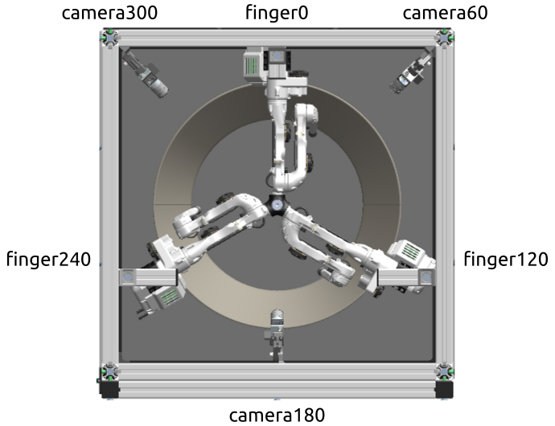

.. _finger_and_camera_names:

****************************
Names of Fingers and Cameras
****************************

The individual fingers of the robot as well as the cameras have names based on
their angular position around the centre of the robot, with zero being at the
position of the first finger:

In the software, data about the fingers is always given in the order finger0,
finger120, finger240.  Likewise camera data is provided in the order camera60,
camera180, camera300.

On the TriFingerPro platforms, the door of the box is on the side of camera180.

.. note::

   On TriFingerPro camera60 and camera300 are mounted in the corners of the box
   (as shown above), so they are not exactly at the 60° and 300°, the names are
   a bit of an approximation here.
   On TriFingerEdu, the camera mounts are always in the middle between the
   fingers, so there the names are accurate.
